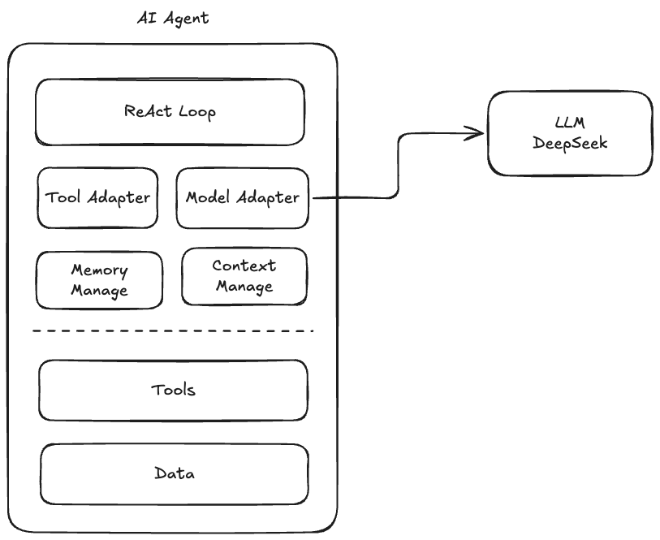
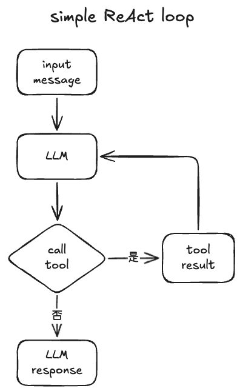

# 如何实现一个 AI Agent

## AI Agent 是什么
**AI Agent（人工智能智能体）** 是一个能够**自主感知环境、进行推理决策并采取行动**，以实现特定目标的人工智能系统

你可以把它理解为一个“**会行动、会协作、会学习的数字员工**”。如果说传统的大模型（如DeepSeek）是“大脑”，AI助手是“会说话的大脑”，那么AI Agent就是拥有了“手和脚”，能够真正动手完成任务的智能体。

### AI Agent 与聊天机器人的区别

| 特征 | AI Agent  | 聊天机器人 |
|  ----  | ----  | ----  |
| 工作方式  | 主动执行：用户设定目标，它自主规划并完成 | 被动响应：用户提问，它回答 |
| 任务处理  | 处理复杂、多步骤的任务 | 处理简单、单步的指令 |
| 规划能力  | 能自主将目标拆解为可执行的子任务 | 遵循预设的对话路径或规则 |
| 工具使用  | 能动态调用外部工具，如搜索引擎、数据库、代码环境等 | 通常只能调用预设的简单 API |
| 典型场景  |  |  |

## AI Agent 由哪些部分组成
AI Agent 由这几个核心部分组成：
- **ReAct Loop 模块**：通过一个迭代循环来工作，其典型轨迹由*思考（Thought）*、*行动（Action）* 和 *观察（Observation）* 三个关键步骤组成。核心目标是让AI模型从“被动应答者”升级为能主动与外部世界交互的“问题解决者”。
- **工具调用模块**：这是Agent的 “四肢和感官”，让它能影响外部世界，大模型本身只有文本输出，靠工具模块来“动手”。
- **行动与执行模块**：这是Agent的“执行手脚”，负责将规划好的指令转化为具体的物理或数字操作。（它与“工具调用模块”在某种程度上是可以合并成一个模块的）
- **记忆系统**：这是Agent的 “档案管理员”，让它不至于“说完就忘”，分为两种：*短期记忆（上下文）* 、*长期记忆（向量存储）* 。
- **大模型**：这是Agent的 *“中枢神经”*，负责所有的理解和推理。它不直接干活，而是负责“思考”。



## 实现过程

### LLM 接口简介
先了解一下大模型的接口，这样才能为实现 AI Agent 打下基础，下面以 DeepSeek 的 API 为例。

#### 简单对话

``` JavaScript
async function agentChat(userPrompt) {

  const body = {
    model: 'deepseek-v4-flash',
    messages: [
      { role: 'system', content: '你是一个智能助手，回答用户的问题。' },
      { role: 'user', content: userPrompt },
    ]
  };

  const response = await fetch('https://api.deepseek.com/v1/chat/completions', {
    method: 'POST',
    headers: {
      'Content-Type': 'application/json',
      'Authorization': `Bearer ${process.env.DEEPSEEK_API_KEY}`
    },
    body: JSON.stringify(body)
  });

  const responseData = await response.json();
  const message = responseData.choices[0].message;

  return message.content;
}

export default agentChat;
```

> 上面这段代码是调用大模型最基础的方式：构造一个 `messages` 数组，里面放上 `system`（给模型设定角色）和 `user`（用户的问题），然后发一个 POST 请求到 DeepSeek 的 API。返回结果里 `choices[0].message.content` 就是模型的回复文本。就这么简单。

#### 多轮对话

``` JavaScript
const history = [];
async function agentChatMultiTurn(userPrompt) {

const body = {
  model: 'deepseek-v4-flash',
  messages: [
    { role: 'system', content: '你是一个智能助手，回答用户的问题。' },
    ...history,
    { role: 'user', content: userPrompt },
  ]};

  const response = await fetch('https://api.deepseek.com/v1/chat/completions', {
    method: 'POST',
    headers: {
      'Content-Type': 'application/json',
      'Authorization': `Bearer ${process.env.DEEPSEEK_API_KEY}`
    },
    body: JSON.stringify(body)
  });

  const responseData = await response.json();
  const message = responseData.choices[0].message;

  history.push(
    { role: 'user', content: userPrompt },
    { role: 'assistant', content: message.content });

  return message.content;
}

export default agentChatMultiTurn;
```

> 多轮对话的关键在于 `history` 数组——每次对话后，我们把用户的提问和模型的回答都 push 进去，下次请求时一起带上。这样模型就能"记住"之前聊过什么。**这也是后面记忆系统的基础思路。**

#### 工具调用

工具定义
``` JavaScript
function tools() {
  const toolList = [
    {
      definition: {
        name: "current_time",
        description: "获取当前日期和时间，以及所在时区。不需要任何参数。",
        parameters: {
          type: "object",
          properties: {
            timezone: {
              type: 'string',
              description: '可选。时区，例如 "Asia/Shanghai", "America/New_York"，默认本地时区',
            },
          },
        },
      },
    
      execute: async ({ timezone } = {}) => {
        const now = new Date();
        const tz = timezone || Intl.DateTimeFormat().resolvedOptions().timeZone;
        return JSON.stringify({
          iso: now.toISOString(),
          local: now.toLocaleString('zh-CN', { timeZone: tz }),
          date: now.toLocaleDateString('zh-CN', { timeZone: tz, weekday: 'long', year: 'numeric', month: 'long', day: 'numeric' }),
          time: now.toLocaleTimeString('zh-CN', { timeZone: tz }),
          timezone: tz,
        });
      },
    },
    {
      definition: {
        name: 'calculator',
        description: "执行数学计算。支持加减乘除、乘方、三角函数等。输入一个数学表达式，返回计算结果。",
        parameters: {
          type: 'object',
          properties: {
            expression: {
              type: 'string',
              description: '数学表达式，例如: "2 + 3 * 4", "sqrt(144)", "sin(pi/2)"',
            },
          },
          required: ['expression'],
        },
      },
    
      execute: async ({ expression }) => {
        try {
          // 安全地执行数学表达式（只用 Math 函数，不执行任意代码）
          const sanitized = expression.replace(/\^/g, '**');
          const allowed = new Set([
            'abs', 'ceil', 'floor', 'round', 'max', 'min',
            'sqrt', 'pow', 'sin', 'cos', 'tan', 'log', 'log2', 'log10',
            'PI', 'E', 'exp',
          ]);
          const result = Function(
            ...allowed,
            `return (${sanitized})`
          )(...Array.from(allowed).map((name) => Math[name]));
          return JSON.stringify({ expression, result });
        } catch (e) {
          return JSON.stringify({ error: `计算失败: ${e.message}` });
        }
      },
    }
  ];

  return {
    definition: toolList.map(tool => {
      return {
        type: 'function',
        function: {
          name: tool.definition.name,
          description: tool.definition.description,
          parameters: tool.definition.parameters,
        }
      }
    }),
    execute: async (name, args) => {
      const tool = toolList.find(tool => tool.definition.name === name);
      if (!tool) {
        return `错误: 没有名为 "${name}" 的工具。可用工具: ${toolList.map(tool => tool.definition.name).join(", ")}`;
      }
      return await tool.execute(args);
    }
  }
}
```

> 这段工具定义代码有两个层次：
> 1. **`definition`**：告诉大模型"我有什么工具、参数是什么"——模型靠这个来决定要不要调用工具、传什么参数。
> 2. **`execute`**：真正干活的函数，模型不会直接执行它，而是由我们的代码拿到模型返回的工具名和参数后，再去调用。
>
> 注意计算器的 `execute` 用了一个白名单机制——只允许 `Math` 对象里的安全函数（比如 `sin`、`sqrt`），而不是直接 `eval()`，避免用户传入恶意代码。

``` JavaScript
  const body = {
    model: 'deepseek-v4-flash',
    messages,
    tools,
    temperature: 0.1
  };

  const response = await fetch('https://api.deepseek.com/v1/chat/completions', {
    method: 'POST',
    headers: {
      'Content-Type': 'application/json',
      'Authorization': `Bearer ${process.env.DEEPSEEK_API_KEY}`
    },
    body: JSON.stringify(body)
  });
  return response.json();
}

async function agentTool(userPrompt) {

  const messages = [
    { role: 'system', content: '你是一个智能助手，能够使用工具来完成任务。可以使用工具执行数学计算、获取当前时间。' },
    { role: 'user', content: userPrompt },
  ];

  const response = await deepseek(messages, tools().definition);
  const resMessage = response.choices[0].message;

  let content = resMessage.content;
  if (resMessage.tool_calls) {
    const toolCall = resMessage.tool_calls[0];
    const toolName = toolCall.function.name;
    const toolArgs = JSON.parse(toolCall.function.arguments);
    const toolResponse = await tools().execute(toolName, toolArgs);

    messages.push(resMessage);
    messages.push({ role: 'tool', tool_call_id: toolCall.id, content: toolResponse });
    
    console.log(`${toolName}的返回结果是：${toolResponse}`);

    const res2 = await deepseek(messages);
    const res2Message = res2.choices?.[0]?.message;
    content = res2Message?.content;
  }

  return content;
}

export default agentTool;
```

> 这段代码展示了工具调用的完整流程，可以拆成四步：
> 1. **第一次调用 LLM**：把用户问题 + 工具定义一起发过去。
> 2. **模型返回 tool_calls**：模型判断"这个问题需要调用工具"，于是返回工具名和参数，而不是直接回答。
> 3. **执行工具**：我们的代码根据模型返回的工具名，找到对应的 `execute` 函数，传入参数，拿到结果。
> 4. **第二次调用 LLM**：把工具执行结果作为新消息追加到对话中，再让模型根据结果生成最终的自然语言回答。
>
> 这就是 AI Agent "动手能力"的核心流程——模型负责思考"该用什么工具"，代码负责执行，结果再还给模型总结。

### LLM 调用模块
大模型调用模块其实很简单，就是将各大模型厂商的 API 接口做一层封装，让 Agent 系统调用不同模型的方式是保持一致的。先简单用 DeepSeek 做一层封装。

``` JavaScript
import "dotenv/config";

export default async function deepseek({ modelId = 'deepseek-v4-flash', messages, tools, temperature = 0.1}) {

  const body = {
    model: modelId,
    messages,
    tools,
    temperature
  };

  const response = await fetch('https://api.deepseek.com/v1/chat/completions', {
    method: 'POST',
    headers: {
        'Content-Type': 'application/json',
        'Authorization': `Bearer ${process.env.DEEPSEEK_API_KEY}`
    },
    body: JSON.stringify(body)
  })
  
  return response.json();
}
```

``` JavaScript
import deepseek from './deepseek.js';
import kimi from './kimi.js';

async function callModel(model, params) {
  const modelMap = {
    'deepseek': deepseek,
    'kimi': kimi
  };

  if (!modelMap[model]) {
    throw new Error(`Unknown model: ${model}`);
  }

  return await modelMap[model](params);
}
```

> 这里用了一个简单的**适配器模式**：不管底层接的是 DeepSeek 还是 Kimi，上层调用方只需要传模型名 + 统一参数格式，`callModel` 负责路由到对应的实现。这样做的好处是——以后换模型、加模型，不用改业务代码，只改这一个地方。

### 工具调用模块&执行模块
工具的调用和执行分两部分：
1. 工具的定义：将工具名称、入参、出参等定义提供给大模型，让大模型能够理解工具如何使用。
2. 工具的执行：具体工具的执行，将对应的入参给到工具，工具运行完后给到执行后的结果。

以下用数学计算工具为例子：

``` JavaScript
// tools/calculator.js
const calculator = {
  definition: {
    name: 'calculator',
    description: "执行数学计算。支持加减乘除、乘方、三角函数等。输入一个数学表达式，返回计算结果。",
    parameters: {
      type: 'object',
      properties: {
        expression: {
          type: 'string',
          description: '数学表达式，例如: "2 + 3 * 4", "sqrt(144)", "sin(pi/2)"',
        },
      },
      required: ['expression'],
    },
  },

  execute: async ({ expression }) => {
    try {
      // 安全地执行数学表达式（只用 Math 函数，不执行任意代码）
      const sanitized = expression.replace(/\^/g, '**');
      const allowed = new Set([
        'abs', 'ceil', 'floor', 'round', 'max', 'min',
        'sqrt', 'pow', 'sin', 'cos', 'tan', 'log', 'log2', 'log10',
        'PI', 'E', 'exp',
      ]);
      const result = Function(
        ...allowed,
        `return (${sanitized})`
      )(...Array.from(allowed).map((name) => Math[name]));
      return JSON.stringify({ expression, result });
    } catch (e) {
      return JSON.stringify({ error: `计算失败: ${e.message}` });
    }
  },
};

export default calculator;
```

``` JavaScript
// tools/index.js
import calculator from './calculator.js';
import currentTime from './current-time.js';
import httpRequest from './http-request.js';
import balance from './balance.js';

const TOOLS = [
  calculator,
  currentTime,
  httpRequest,
  balance,
];

export default {
  definition: TOOLS.map(tool => {
    return {
      type: 'function',
      function: {
        name: tool.definition.name,
        description: tool.definition.description,
        parameters: tool.definition.parameters,
      }
    }
  }),
  execute: async (name, args) => {
    const tool = TOOLS.find(tool => tool.definition.name === name);
    if (!tool) {
      return `错误: 没有名为 "${name}" 的工具。可用工具: ${TOOLS.map(tool => tool.definition.name).join(", ")}`;
    }
    return await tool.execute(args);
  }
};
```

> 这里的设计思路是**统一工具注册中心**：`tools/index.js` 是所有工具的"花名册"——`definition` 汇总了所有工具的接口描述供 LLM 查阅，`execute` 则根据工具名路由到具体实现。要新增一个工具只需要两步：写好工具文件、在 `TOOLS` 数组里注册一下就行。

### ReAct Loop 机制

设计一个简单的 ReAct Loop 机制



``` JavaScript
import tools from './tools/index.js';
import deepseek from './models/deepseek.js';

async function agentLoop(userPrompt) {
  const messages = [
    { role: 'system', content: '你是一个智能助手，能够使用工具来完成任务。' },
    { role: 'user', content: userPrompt },
  ];

  const maxTurns = 10;

  for (let i = 0; i < maxTurns; i++) {
    console.log(`Loop ${i + 1}:`);

    const response = await deepseek({
      messages, 
      tools: tools.definition
    });

    const resMessage = response.choices?.[0].message;
    let content = resMessage?.content;

    console.log(`Thought：${resMessage?.reasoning_content}`)
    if (resMessage?.tool_calls && resMessage.tool_calls.length > 0) {
      const toolCall = resMessage.tool_calls[0];
      const toolName = toolCall.function.name;
      const toolArgs = JSON.parse(toolCall.function.arguments);
      const toolResult = await tools.execute(toolName, toolArgs);
      content = toolResult;
      console.log(`Tool：${toolName}，Result：${toolResult}`)

      // messages.push({ role: 'tool', tool_call_id: toolCall.id, content: toolResult });
      messages.push({ role: 'assistant', content: toolResult });
      console.log(`${"═".repeat(60)}`);
    }
    else {
      console.log(`${"═".repeat(60)}`);
      break;
    }
  }

  const finalResponse = await deepseek({ messages });
  return finalResponse.choices?.[0]?.message?.content;
}

export default agentLoop;
```

> 这个 `for` 循环就是 ReAct Loop 的"引擎"，每一轮循环对应一次 **Thought → Action → Observation**：
> 1. **Thought（思考）**：调用 LLM，模型决定要不要用工具、用哪个工具。`reasoning_content` 里可以看到模型的推理过程。
> 2. **Action（行动）**：如果模型返回了 `tool_calls`，代码就执行对应的工具。
> 3. **Observation（观察）**：工具执行结果追加回 `messages`，下一轮循环时模型就能看到"上次行动的结果"。
>
> `maxTurns = 10` 是一个**安全阀**，防止模型陷入无限循环（比如不停调用同一个工具但得不到想要的结果）。实际项目中还可以加入更多终止条件，比如检测到模型连续两次调用同一工具且结果相同时主动退出。

### 记忆系统
AI Agent 的记忆系统通常分如下几层：

- 短期记忆：在当前会话中保持上下文连贯性，让Agent“不健忘”。
- 长期记忆：跨会话持久化信息，让Agent“有积累”，实现个性化。
  - 情景记忆：记录特定时空下的事件和经历，如“用户上周三问了XX问题”。
  - 语义记忆：存储客观事实、知识和用户偏好，如“用户喜欢Python”。
  - 程序记忆：存储“如何做”的技能和流程，如“当API报错时，执行重试策略”。

用一个生活化的类比来理解：
> - **短期记忆**就像你桌上的**便利贴**——记着当前对话的关键信息，上下文窗口一满，旧的便利贴就被新的覆盖掉。
> - **长期记忆**就像你的**笔记本**——跨多次对话持久保存，下次聊天时可以翻出来回顾。实现上通常靠向量数据库 + RAG（检索增强生成）：把历史信息存成向量，需要时检索相关内容，拼到当前对话里。

我们上面的”多轮对话”例子其实就是一个短期记忆的简单方案，长期记忆一般通过RAG系统（检索增强生成）进行存储和检索，RAG的细节部分我们会在后面的学习中提到。设计一个优秀的AI Agent记忆系统，关键在于借鉴认知科学的分层架构，并实现一套完整的“写入-管理-读取”生命周期管理机制，细节我们不在这个地方详细讲述，未来会有专门的文章中详细讲解。

### 待改进

上面我们实现的是一个最简化的 AI Agent demo，离一个"能打"的 Agent 还差不少东西。以下是一些值得改进的方向：

**工具调用方面**
- **并行工具调用**：目前一次只调一个工具。实际场景中，模型可能需要同时查天气、算时间、搜网页——并行调用能大幅提升效率。
- **工具选择优化**：目前完全依赖模型判断用什么工具。当工具多了以后（几十上百个），可以加一层**工具路由**，先根据用户意图缩小候选范围，再让模型选，既省钱又准确。
- **工具结果压缩**：有些工具返回的数据很大（比如网页爬取），直接全量塞进 messages 会撑爆上下文窗口。需要对结果做摘要或截断。

**错误处理与鲁棒性**
- **重试机制**：工具调用可能因为网络抖动而失败，直接抛错就结束了。应该加入指数退避重试。
- **异常兜底**：当模型返回了不存在的工具名、或者参数格式错误时，应该给模型反馈让它修正，而不是直接崩溃。
- **超时控制**：每个工具调用都应该有超时限制，防止某个工具卡死拖垮整个 Agent。

**记忆系统**
- 目前仅用 `history` 数组实现了最简单的短期记忆，真正的长期记忆（向量存储 + RAG）还没落地。
- 缺少**记忆管理**机制——什么该记、什么该忘、记忆如何更新，这些在实际系统中都是需要仔细设计的。

**安全与可控性**
- **人工确认**：涉及花钱、删数据、发邮件等敏感操作时，应该在执行前让用户确认。
- **权限边界**：限制 Agent 只能访问哪些工具、哪些数据，避免"越权"操作。
- **输入校验**：对工具参数做校验，防止模型"幻觉"出不合理参数导致工具崩溃。

**工程化**
- **流式输出**：目前是等模型全部生成完才拿到结果，用户体验不够好。支持 SSE 流式输出可以让回复"逐字出现"。
- **可观测性**：加日志、trace、指标监控，出问题时能快速定位是模型推理错了还是工具执行错了。
- **多 Agent 协作**：复杂任务可能需要多个 Agent 分工合作，各自负责不同领域，通过消息传递协调。

这些改进点我们会在后续文章中逐一展开实现。

## 总结

我们这篇文章从零开始，一步步了解了 AI Agent 是什么、由哪些部分组成、以及如何用代码实现一个最简版本。回顾一下核心四件套：

1. **LLM（大模型）**：Agent 的大脑，负责理解意图、推理决策、生成回复。
2. **工具系统**：Agent 的手和脚，让它能查时间、算数学、发请求——真正"动手做事"。
3. **ReAct Loop**：Agent 的工作循环，在"思考 → 行动 → 观察"中不断推进任务。
4. **记忆系统**：Agent 的笔记本，短期记住当前上下文，长期积累用户偏好和知识。

用一句话概括：**AI Agent = LLM + 工具 + 循环 + 记忆。**

目前我们实现的还是一个"毛坯房"版本，有很多地方可以打磨——工具调用更智能、错误处理更健壮、记忆系统真正落地、安全机制到位。但万变不离其宗，所有复杂的 Agent 框架（LangChain、AutoGPT、CrewAI 等）底层都离不开这四个核心组件。

建议你亲手把上面的代码跑一遍，感受一下 Agent 的完整链路。只有真正动手写过，才能理解每个环节为什么这么设计，也才能更好地驾驭那些"开箱即用"的框架。后面的文章我们会逐步把这个 demo 打磨成一个更完整、更实用的 AI Agent，敬请期待。